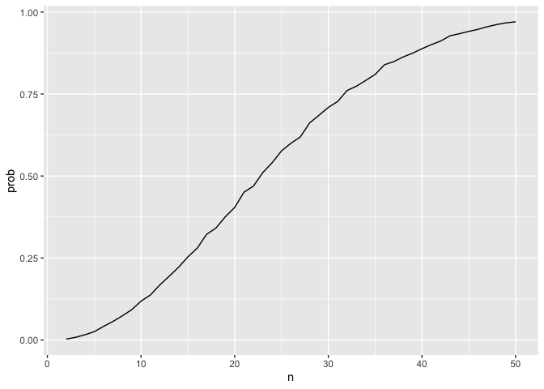

p8105_hw5_sy3269
================
Soomin You

## Problem 1

For n people in a room, we will check for any duplicate birthdays. Some
of the assumptions we make are as follows:

1)  there are at least two people share the same birthday
2)  there are no leap years
3)  birthdays are uniformly distributed over the year

``` r
bday_sim = function(n) {

  bdays = sample(1:365, size = n, replace = TRUE)
  
  duplicate = length(unique(bdays)) < n

  return(duplicate)
  
}
```

If the simulation is ran 10,000 times for each group size between 2 and
50, we get the following function.

``` r
sim_res = 
  expand_grid(
    n = 2:50,
    iter = 1:10000
  ) |> 
  mutate(res = map_lgl(n, bday_sim)) |> 
  group_by(n) |> 
  summarize(prob = mean(res))
```

The probability that at least two people in the group share a birthday
is averaged across the 10000 simulation runs and the probability as a
function of group size was plotted. If we have about 23 people, there is
a 0.5 probability of at least two people sharing the same birthday.

``` r
sim_res |> 
  ggplot(aes(x = n, y = prob )) + 
  geom_line()
```

<!-- -->

## Problem 2

Setting n = 30, $\sigma$ = 5, a normal distribution function is
generated. Then, `sim_data` with 5000 datasets as where $\mu$ = 0 were
created using iteration.

``` r
fcn_mean_sd = function(true_mu) {
  
  design = 
    tibble(
      x = rnorm(n = 30, mean = true_mu, sd = 5)
    )
  
  t_test_result = t.test(design, conf.level = 0.95) |>
    broom::tidy() |>
    select(estimate, p.value)
  
  return(t_test_result)
}


sim_data = 
  expand_grid(
    mu = 0,
    iter = 1:5000
  ) |>
  mutate(result = map(mu, fcn_mean_sd)) |>
  unnest(result) 
```

The same iteration using the same function was performed for $\mu$ = {1,
2, 3, 4, 5, 6} and the data was named as `sim_result.` Then, a plot
showing the proportion of times where the null was rejected versus the
true value of $\mu$ was made.

``` r
sim_result = 
  expand_grid(
    mu = c(0:6),
    iter = 1:5000
  ) |>
  mutate(result = map(mu, fcn_mean_sd)) |>
  unnest(result) 
  

sim_result |>
  group_by(mu) |>
  summarize(prop = mean(p.value < 0.05)) |>
  ggplot(aes(x = mu, y = prop)) +
  geom_point() +
  labs(
    x = "true mu", 
    y = "Power"
  )
```

<!-- -->

According to the graph, there is a positive association between the
effect size and power. The larger the effect size is, the greater the
power is.

Then, a plot showing the average estimate of $\mu$ on the y axis and teh
true value of $\mu$ on the x axis was made. Only the estimates of $\mu$
for which the null was rejected were graphed.

``` r
sim_result |>
  filter(p.value < 0.05) |>
  group_by(mu) |> 
  summarize(avg_mu = mean(estimate)) |>
  ggplot(aes(x = mu, y = avg_mu)) +
  geom_point() +
  labs(
    x = "true mu", 
    y = "average estimate of mu"
  )
```

<!-- -->

The sample average estimate of $\mu$ across tests for which the null is
rejected is not approximately equal to the true value of $\mu$ and this
is because of selection bias. Since only the test results of which the
null is rejected was plotted, selection bias may have affected.

However, from $\mu$ equal to or greater than 3, the true $\mu$ and the
estimate $\mu$ became approximately equal. It can be inferred that there
is a greater variability when the $\mu$ is smaller.

## Problem 3

The *Washington Post* has gathered data on homicides in 50 large U.S.
cities. The raw data summarizes 52,179 homicide cases and there was a
case with incorrect information. A case that occurred in Tulsa, with uid
starting with `Tul` had state information classified as `AL` instead of
`OK`. Since Tulsa is located in Oklahoma, the incorrect information was
updated as shown below.

Then, a new column with `city_state` information was added to the
dataset.

``` r
homicide_data = read_csv("./homicide-data.csv") |>
  janitor::clean_names() |>
  mutate(state = ifelse(city == "Tulsa" & state == "AL", "OK", state),
         city_state = str_c(city, state, sep = ", "))
```

    ## Rows: 52179 Columns: 12
    ## ── Column specification ────────────────────────────────────────────────────────
    ## Delimiter: ","
    ## chr (9): uid, victim_last, victim_first, victim_race, victim_age, victim_sex...
    ## dbl (3): reported_date, lat, lon
    ## 
    ## ℹ Use `spec()` to retrieve the full column specification for this data.
    ## ℹ Specify the column types or set `show_col_types = FALSE` to quiet this message.

``` r
case_data = 
  homicide_data |>
  group_by(city_state) |>
  summarize(
    total_cases = n(), 
    unsolved_cases = sum(disposition != "Closed by arrest")
  ) 
```

For the city of Baltimore, MD, `prop.test` was performed on the unsolved
cases out of the total homicide cases. The estimate and confidence
interval data was extracted from the `prop.test` results.

``` r
x = case_data |>
  filter(city_state == "Baltimore, MD") |>
  pull(unsolved_cases) 
  
n = case_data |>
  filter(city_state == "Baltimore, MD") |>
  pull(total_cases)
  
baltimore_prop = 
  prop.test(x, n) |>
  broom::tidy() |>
  select(estimate, conf.low:conf.high)
```

The above was made into a function.

``` r
city_state_prop = function(name) {
  
  x = case_data |>
    filter(city_state == name) |>
    pull(unsolved_cases) 
  
  n = case_data |>
    filter(city_state == name) |>
    pull(total_cases)
  
  prop.test(x, n) |>
    broom::tidy() |>
    select(estimate, conf.low:conf.high)
}


city_state_prop("Baltimore, MD")
```

    ## # A tibble: 1 × 3
    ##   estimate conf.low conf.high
    ##      <dbl>    <dbl>     <dbl>
    ## 1    0.646    0.628     0.663

To extract the proportion and confidence interval for each city, the
following loop was done.

``` r
unique_city_state = 
  case_data |>
  distinct(city_state) |>
  pull(city_state)


city_state_sim = 
  tibble(
    unique_name = unique_city_state
  ) |>
  mutate(data = map(unique_name, city_state_prop)) |>
  unnest(data) |>
  janitor::clean_names()
```

Then, a plot showing the estimates and CIs for each city was made.

``` r
city_state_sim |>
  mutate(unique_name = fct_reorder(unique_name, estimate)) |>
  ggplot(aes(x = unique_name, y = estimate)) + 
  geom_point() + 
  geom_errorbar(aes(ymin = conf_low, ymax = conf_high)) +
  theme(
    axis.text.x = element_text(angle = 90, vjust = 0.5, hjust = 1)) +
  labs(
    x = "City, State", 
    y = "Estimate proportion and CI", 
    title = "Unsolved Homicides in the US Cities", 
    caption = "Data on homicides in 50 large US cities gathered by the Washington Post was used."
  )
```

<!-- -->
